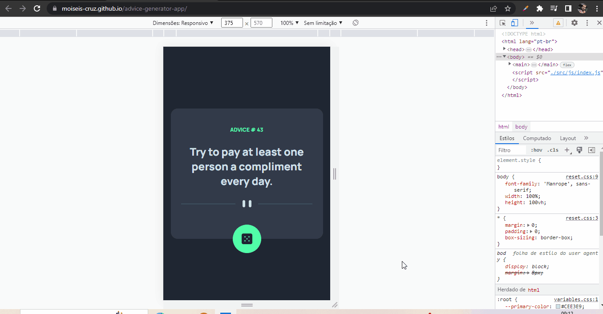

# advice-generator-app

Este é um desafio do Frontend Mentor, que também é proposto pelo curso DevQuest para testar as minhas habilidades com as tecnologias estudadas até então.

Projeto que ultiliza API para gerar conselhos aleatoriamente.

Criei variáveis para poder trabalhar com os objetos das API. Uma para o número do conselho, e, outra para o conselho. Depois, pude usá-las para manipular o DOM usando o innerHTML para assim poder gerar os conselhos.

<strong>Link da API :</strong> 
https://api.adviceslip.com/

## Tecnologias ultilizadas:
- HTML;
- CSS;
- JS (JavaScript);
- API;

